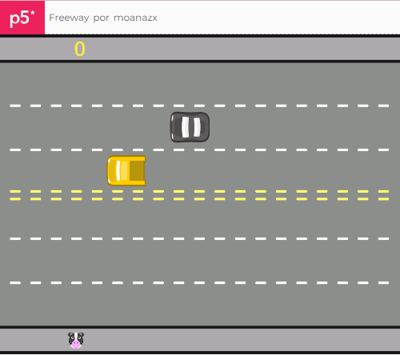

## Project 

A game where the player controls a cow that has to cross a highway full of cars and trucks, with six lanes.

Freeway, an exciting game where you take control of a brave cow on a mission to cross a busy highway full of cars and trucks. Your dexterity and navigational skills will be tested as you guide the cow safely through six obstacle-filled tracks. In Freeway, you'll face the challenge of helping the cow navigate the chaotic highway traffic. The task is to cross all six lanes without colliding with moving vehicles. Each time you reach the other side of the highway, you score a point. Showing your timing and navigation skills to reach the other side successfully.

## Features
* Scoring and Records: Earn points for each successful crossing. Try to beat your high score with each attempt.
* Simple Controls: Use the keyboard arrow keys to move the cow up, down, left and right.
* Tactical Evolution: At each level, you'll learn to better anticipate vehicle movements and plan your crossing more efficiently.
* Objective: Guide the cow through the busy lanes of the highway, avoiding collisions with vehicles.
* Controls: Use your keyboard's arrow keys to move the cow in the corresponding directions.
* Scoring: Earn points for each successful crossing. Beat your previous scores to progress.

Check it out at https://editor.p5js.org/moanazx/full/DbMRTb7FR

